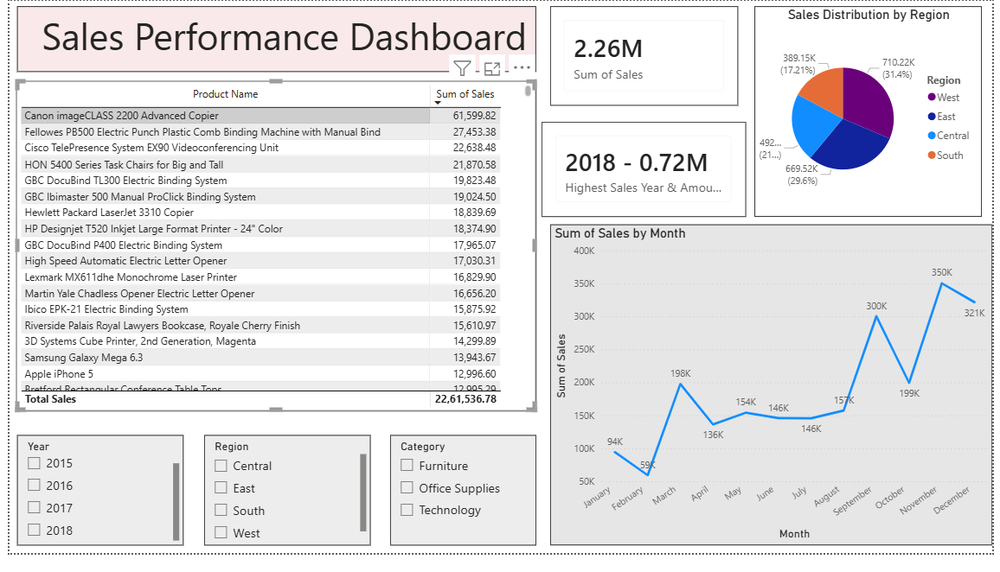

# 📊 Sales Performance Dashboard

## 📌 Project Overview

This project presents a Sales Performance Dashboard built using Power BI. The dashboard provides insights into sales trends, top-performing products, and regional performance.

## 🛠 Tools Used

* Python (Pandas, Matplotlib)
* Power BI
* Excel

## 📊 Key Features

* Total Sales KPI
* Highest Sales Year Analysis
* Monthly Sales Trend
* Sales Distribution by Region
* Top Products Analysis
* Interactive Filters (Year, Region, Category)

## 📈 Insights

* Sales peaked in 2018
* West region contributed the highest sales
* Certain products significantly outperform others

## 📂 Files Included

* Sales Dashboard (.pbix)
* Cleaned dataset (.csv)

## 🚀 Author

Ponnapureddy Tejeswarreddy
